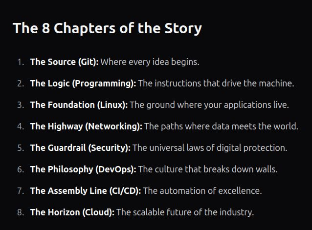

# le début

# The Source (Git)
Why Version Control is the first line of defense in the DevSecOps lifecycle.

Version control provides three critical security pillars:

1. **Traceability:** If a vulnerability is discovered in production, Git allows us to trace it back to the exact line of code, the person who wrote it, and the date it was introduced.
2. **Collaboration (The Peer Review):** Through "Pull Requests," we ensure that no code reaches the live environment without a second pair of eyes. This is our first human firewall.
3. **Recovery:** If an automated script goes rogue or a malicious actor gains access, Version Control allows us to "roll back" to the last known secure state in seconds.

# Review pull requests

https://github.com/skills/review-pull-requests

this git provides basic knowledge on 

- How to open a pull request for proposed changes.
- How to assign pull requests for review.
- How to review a pull request.
- How to suggest changes to a pull request.
- How to merge a pull request after incorporating feedback.

# Version Control System
It is a software that tracks changes to files over time, allowing individuals or teams to manage source code, revert to previous versions, and collaborate. In DevSecOps, the Code is the lock. If you don't understand basic programming concepts like variables, loops, and functions, you cannot "read" the vulnerabilities in an application. You won't be able to spot a SQL Injection hidden in a line of Python, or understand why a poorly written loop might crash a cloud server, causing a Denial of Service (DoS).

e without overwriting work.
https://thedevops.guide/guide/version-control-system

# Git Immersion

A guided tour that walks through the fundamentals of Git
https://gitimmersion.com/

# Secure Code

In DevSecOps, if we don't understand basic programming concepts such as variables, loops, and functions, we cannot "read" vulnerabilities in an application. We won't be able to spot SQL Injection hidden in a line of Python code or understand why a poorly written loop might crash a cloud server, causing a Denial of Service (DoS).

https://youtu.be/ix9cRaBkVe0?si=-TXZNgzlceF147jw

# Linux Fundas

Being comfortable with the Linux terminal provides many capabilities

- Advanced File Management: 
  Efficiently navigating, creating, moving, renaming, or deleting files and directories, particularly when dealing with large numbers of files        recursively, which is often faster via CLI.
- System Administration & Troubleshooting: 
  Directly monitoring system performance (using tools like top), killing unresponsive processes (kill), managing user accounts, and changing file     permissions (chmod, chown).
- Automation and Scripting:
  Combining commands with pipes (|) and creating shell scripts (Bash, Zsh) to automate repetitive tasks saves time and improves productivity.
  Software Installation & Updates: Installing, updating, and removing software packages from repositories using commands like apt, yum, or dnf in a   single line.
- Remote Access and Management: 
  Accessing remote servers securely using SSH (Secure Shell) enables administrators to manage servers without a GUI, which is standard for web      hosting and cloud infrastructure.
- Text Processing and Configuration: 
  Editing configuration files directly using text editors like vi, vim, or nano, and using tools like grep, sed, and awk to manipulate, filter, and   extract information from data or log files.
- Network Diagnostics: 
  Testing network connectivity, checking interface status, and tracing network paths using tools like ifconfig, ip, and traceroute.
- Customization: 
  Creating custom aliases for long commands and managing environment variables to personalize the working environment.

# Networking 

Here I will be sharing a CCNA playlist from Network Chuck, which I prefer the best content and the fun way to learn.

https://www.youtube.com/playlist?list=PLIhvC56v63IJVXv0GJcl9vO5Z6znCVb1P

# Security

We need to know the basics of security, not only about securing the CI/CD pipelines, Docker, and containers. It is a broader methodology that integrates security throughout the entire software development lifecycle (SDLC).

We can actually learn from academies like TryHackMe, HTB, LetsDefend, CyberWarfare, etc.

Please refer to the link for basic CyberSecurity 

https://www.geeksforgeeks.org/ethical-hacking/what-is-cyber-security/

- The industry standard list of the most critical web application security risks. https://owasp.org/Top10/2025/

# DevOps vs SRE

https://www.youtube.com/watch?v=0yWAtQ6wYNM

In this video, we will learn about DevOps, its challenges, tools, tasks, and responsibilities of a DevOps engineer.
Though DevOps focuses on releasing quality code fast, while SRE focuses on reliability (which keeps the system stable and allows fast changes).

# CI/CD
- Continuous Integration (CI): Every time code is committed to The Source, the assembly line automatically builds the app and runs tests. If the logic is broken, the build fails.
- Continuous Delivery/Deployment (CD): Once the code is tested, the assembly line automatically moves it to the next environment (Testing, Staging, or Production).
- Continuous Security (The "Sec" in the middle): This is where we plug in our automated "sensors". We run static analysis (SAST), dependency checks, and secret scanners directly on the assembly line.

https://thedevops.guide/guide/ci-cd
